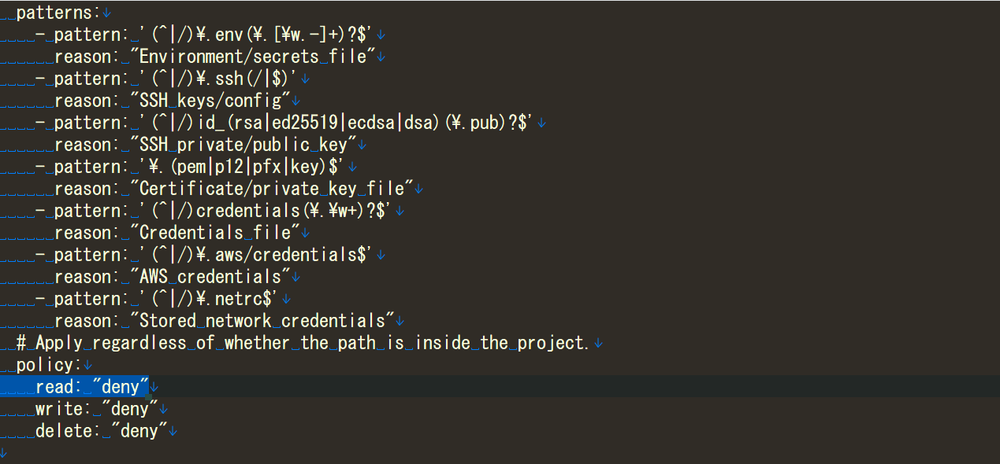

# PolicyApprovalGate

[English](README.md) | [日本語](README.ja.md)

PolicyApprovalGate is a PreToolUse hook that checks shell commands against local rules before Claude Code or Codex CLI runs them.

It detects dangerous commands, pushes to protected branches, and access to out-of-project or sensitive paths, then records the decision in an audit log. It does not use AI or an LLM, so the same input always produces the same result.

> [!IMPORTANT]
> PolicyApprovalGate complements the host permission model, sandbox, and human review. It is neither a complete shell analyzer nor a security boundary, and should not be your only line of defense.



In this example, PolicyApprovalGate blocks Claude Code from reading `~/.ssh` and returns the reason to the host.

## Features

- Deterministic decisions based on regex rules and structural analysis
- Always-on denial of recursive force-deletion targeting the filesystem root or current user's home
- Controls for force pushes, deletion, and direct pushes to protected branches
- Read / write / delete classification for file access
- Policies for out-of-project paths, sensitive files, and PolicyApprovalGate's own configuration
- Path tracking that accounts for `cd`, existing symlinks, and symlinks created in the same command
- Normalization for `env` / `command` wrappers, `git -C`, `cp/install -t`, and related forms
- Host-specific handling for Claude Code `ask` decisions and Codex deny conversion
- PowerShell dialect detection, dangerous-command rules, and bounded path extraction on Windows
- Audit log rotation, hashing, and secret redaction
- CLI commands for configuration, upgrades, validation, diagnostics, and hook registration

## Requirements

- Go 1.26
- Claude Code or Codex CLI with PreToolUse hooks

macOS and Linux are the normally supported runtime platforms. Windows is also built and unit-tested in CI, but remains experimental because PowerShell is not fully parsed. See [Windows and PowerShell](#windows-and-powershell) for details.

The fixture and golden tests use these host versions as their compatibility baseline as of August 11, 2026:

| Host | Tested version |
| --- | --- |
| Codex CLI | 0.147.0 |
| Claude Code | 2.1.220 |

## Quick start

### 1. Install

The installer places the binary in `~/.policygate/bin`. **No elevation is needed**

```bash
curl -fsSLO https://raw.githubusercontent.com/nobuo-miura/PolicyApprovalGate/develop/install.sh
less install.sh   # read it before running it
sh install.sh
```

Windows uses `install.ps1` the same way.

```powershell
Invoke-WebRequest -Uri https://raw.githubusercontent.com/nobuo-miura/PolicyApprovalGate/develop/install.ps1 -OutFile install.ps1
Get-Content install.ps1   # read it before running it
powershell -ExecutionPolicy Bypass -File .\install.ps1
```

| Flag | Purpose |
| --- | --- |
| `--version TAG` / `-Version TAG` | Install a specific release (default: the newest published) |
| `--dir PATH` / `-Dir PATH` | Install into this directory (default: `~/.policygate/bin`) |

To build from source instead; tagged releases can also be installed through Go:

```bash
go build -o policygate ./cmd/policygate
go install github.com/nobuo-miura/policyapprovalgate/cmd/policygate@latest
```

### 2. Create a configuration

```bash
policygate init
```

This creates `~/.policygate/config.yaml` by default and never overwrites an existing file. Set `POLICYGATE_CONFIG` to create it elsewhere.

### 3. Register the hook

```bash
policygate install-hook --host claude   # ./.claude/settings.local.json
policygate install-hook --host codex    # ~/.codex/config.toml
```

`install-hook` registers the absolute path of the running binary. It is idempotent, preserves existing settings, and replaces the file atomically. When an existing file changes, PolicyApprovalGate writes a backup first.

Claude Code defaults to `.claude/settings.local.json` because the registration contains a machine-specific absolute path. It does not write that path to the shared, committable `.claude/settings.json`. To enable the hook for every project, use the user-level setting instead:

```bash
policygate install-hook --host claude --user
```

After registering with Codex, run `/hooks`, review the displayed definition, and trust it. Codex skips hooks that are untrusted or have changed since they were trusted.

### 4. Verify the setup

```bash
policygate check-config
policygate doctor
policygate evaluate --host codex --command 'rm -rf /'
```

`evaluate` checks the string without executing the command.

## How decisions work

PolicyApprovalGate evaluates a command in this order:

1. Deny rules
2. Shell syntax parsing
3. Pushes to protected branches
4. Ask rules
5. Path scope, sensitive paths, and protected paths
6. Allow rules for audit classification
7. `unknown.action` or `parse_error.action`

An explicit deny always wins. Allow rules only classify audit records; they never bypass host approval. By default, operations that match no rule are delegated to the host's normal approval flow.

### Host differences

| PolicyApprovalGate decision | Claude Code | Codex CLI |
| --- | --- | --- |
| `deny` | Reject | Reject |
| `ask` | Prompt the user | Convert to `deny` |
| No decision | Use the normal approval flow | Use the normal approval flow |

Codex PreToolUse hooks do not support a standalone `ask` decision, so `--host codex` converts it to `deny`. An omitted `--host` is also treated as non-Claude. Always pass `--host claude` when registering with Claude Code.

## Configuration

[internal/rules/default.yaml](internal/rules/default.yaml) contains every built-in setting and default value.

| Section | Purpose |
| --- | --- |
| `config_version` | Configuration schema version |
| `mode` | `enforce`, or `observe` to record without blocking |
| `deny` | Reject commands matched by Go RE2 regular expressions |
| `ask` | Prompt in Claude Code and reject in Codex |
| `allow` | Classify familiar low-risk commands for audit metadata |
| `protected_branches` | Control pushes to protected branches |
| `path_scope` | Control read / write / delete outside the project |
| `sensitive_paths` | Protect `.env`, SSH keys, credentials, and similar files |
| `protected_paths` | Reject writes and deletes to configuration and hook files |
| `unknown` | Action when no rule matches |
| `parse_error` | Action when shell syntax cannot be parsed |
| `audit` | Audit path, command recording, and rotation |

`unknown.action` and `parse_error.action` accept `defer`, `ask`, or `deny`:

```yaml
unknown:
  action: ask

parse_error:
  action: ask
```

This prompts under Claude Code but rejects under Codex. For example, `unknown.action: ask` under Codex also rejects ordinary build commands when they match no rule. `check-config` and `doctor` detect this combination and print a warning.

### Separate configurations per host

Register separate files when Claude Code and Codex need different behavior:

```bash
policygate install-hook --host claude --config /absolute/path/.policygate/claude.yaml
policygate install-hook --host codex  --config /absolute/path/.policygate/codex.yaml
```

Pass an absolute path to `--config`. If an explicitly selected configuration cannot be loaded, enforce mode rejects the shell call. Validate each file before registering it:

```bash
policygate check-config --config /absolute/path/.policygate/codex.yaml
```

`POLICYGATE_CONFIG` remains available, but `--config` takes precedence. Use `--config` when assigning a different policy to each hook.

> [!WARNING]
> Do not use `/usr/bin/env POLICYGATE_CONFIG=... policygate` on Windows. Windows has no `/usr/bin/env`, so the hook cannot start, and a failed hook does not stop the tool call. In a Codex CLI 0.147.0 test on Windows 11, the command ran without any PolicyApprovalGate audit record. `install-hook --config` starts PolicyApprovalGate directly and avoids this failure.

Keep policy files under `.policygate` when possible so the built-in `protected_paths` rules cover them. If a policy must live elsewhere, add that path to `protected_paths.patterns`.

### Upgrade an existing configuration

Policy files and hook registrations do not update themselves. Refresh both after upgrading PolicyApprovalGate:

```bash
policygate init --upgrade
policygate install-hook --host claude   # include --user if that is how it was registered
policygate doctor
```

`init --upgrade` writes a `config.yaml.bak.*` backup beside the existing file, then replaces it atomically.

User-defined `deny`, `ask`, `allow`, `sensitive_paths.patterns`, and `protected_paths.patterns` lists replace the built-in lists instead of extending them automatically. `--upgrade` restores missing built-in rules and reports each addition as a warning. Review those warnings because a rule removed on purpose may be restored.

## Path evaluation

For POSIX shells, PolicyApprovalGate parses syntax with `mvdan.cc/sh` and classifies supported arguments as read, write, or delete. It handles cases including:

- An earlier `cd`, such as `cd /tmp && rm -rf target`
- Existing symlinks inside the project that point outside it
- Symlinks created earlier in the same chain, such as `ln -s /outside escape && ...`
- Link placement for `ln -s SRC EXISTING_DIR` and `ln -s -t DIR SRC`
- Destinations used by `cp -t DIR SRC` and `install --target-directory=DIR SRC`
- Transparent wrappers such as `env`, `command`, and `nohup`
- Quoted paths containing spaces
- A `cd` inside a pipeline, subshell, conditional, background command, or loop

Paths that depend on unresolved variables, `cd -`, or similar runtime state are treated as indeterminate and evaluated conservatively. Unsupported commands produce no path accesses and continue to other rules or `unknown.action`.

### Case sensitivity

Rule matching for `deny`, `ask`, `allow`, `sensitive_paths`, and `protected_paths` ignores case on every platform. This prevents spellings such as `.ENV` or `RM` from bypassing rules on the default macOS and Windows filesystems.

On a genuinely case-sensitive filesystem, this can over-match a distinct file or program whose name differs only by case. Project containment is the exception: it follows the running platform's default filesystem behavior.

## Windows and PowerShell

The hosts expose PowerShell differently on Windows:

- Codex CLI sends PowerShell commands while reporting `tool_name: "Bash"`
- Claude Code has a `PowerShell` tool, so registration covers both `Bash` and `PowerShell`

PolicyApprovalGate determines the dialect from the host, tool name, and OS. The result appears in `doctor` and in the audit log's `dialect` field. Set `POLICYGATE_SHELL=posix|powershell` to override detection.

PowerShell support tokenizes cmdlets and parameters to recover paths; it is not a complete parser.

| Capability | POSIX | PowerShell |
| --- | --- | --- |
| `deny` / `ask` / `allow` | Supported | Supported |
| `path_scope` / `sensitive_paths` / `protected_paths` | Supported | Supported for recovered paths |
| `cd` tracking | Supported | Not supported; later relative paths become indeterminate |
| Symlink resolution | Supported | Not supported |

The PowerShell classifier handles `-Path`, `-LiteralPath`, `-Destination`, positional arguments, common aliases, and comma-separated arrays. It cannot reliably determine:

- A target arriving through a pipeline
- A path built from variables, subexpressions, or string concatenation
- A relative path after `Set-Location`
- The paths produced by wildcard expansion
- Backtick-obfuscated input

Operations it cannot recover follow `unknown.unanalyzed_action` or `parse_error.unanalyzed_action`, both of which default to `ask`.

Because Codex on Windows converts `ask` to `deny`, the defaults may reject ordinary work. If needed, give Codex its own policy and change the fallback:

```yaml
unknown:
  unanalyzed_action: defer
parse_error:
  unanalyzed_action: defer
```

Text rules and path policies for paths that the PowerShell tokenizer can recover still apply with this setting.

## Audit log

Decisions are written as JSON Lines to `~/.policygate/log/audit.log` by default.

- New directories use mode `0700`; new log files use `0600`
- Permissions of existing directories are left unchanged
- Existing symlinks, FIFOs, devices, and other non-regular files are rejected
- The final log file is opened without following symlinks
- A cross-process lock serializes concurrent writes and rotation
- `max_bytes` and `max_files` control rotation
- `command_mode` supports `redacted`, `full`, `hash`, and `none`

`redacted` recognizes common token assignments, Authorization headers, URL userinfo, curl Basic-auth flags, and MySQL / MariaDB password flags. Redaction is not exhaustive and can also hide ordinary text. Use `hash` or `none` when command contents are unnecessary.

## CLI reference

| Command | Purpose |
| --- | --- |
| `policygate install-hook --host (claude or codex)` | Register a PreToolUse hook |
| `policygate uninstall-hook --host (claude or codex)` | Remove only the PolicyApprovalGate registration |
| `policygate check-config` | Validate the configuration schema and values |
| `policygate doctor` | Diagnose version, OS, configuration, registration, dialect, and self-protection |
| `policygate evaluate --command CMD` | Evaluate a command without executing it |
| `policygate observe` | Record decisions without blocking |
| `policygate version` | Print the version |
| `policygate help` | Print help |

Hook registration supports these flags:

| Flag | Applies to | Purpose |
| --- | --- | --- |
| `--user` | Install and uninstall | Target Claude Code's user settings |
| `--path PATH` | Install and uninstall | Select the registration file |
| `--config PATH` | Install | Add an absolute policy path to the registered command |
| `--dry-run` | Install and uninstall | Print the result without changing the file |

Complete manual examples are available for [Claude Code](configs/claude-code.settings.example.json) and [Codex](configs/codex-config.example.toml). Write Windows paths with forward slashes, as in `D:/bin/policygate.exe`.

Running without arguments enters hook mode and reads one PreToolUse JSON payload from standard input. Unknown subcommands and flags exit with code 2.

## Limitations

- Only shell commands are inspected. Direct file edits and other tools are outside its scope.
- Regex rules and bounded structural analysis cannot fully handle obfuscation or unsupported syntax.
- PowerShell pipelines, variables, and relative paths after `Set-Location` cannot be tracked completely.
- Git aliases are not resolved. Use remote branch protection when the rule must be enforced.
- Command names produced through variable expansion or command substitution cannot be resolved statically.
- Pipelines, subshells, and conditionals are not modeled with complete execution semantics.
- A normal directory created earlier in the same chain does not exist during analysis, so a later `cd` may be treated as failed.
- An invalid explicit policy returns deny, but hook-input, decision-output, or audit-log failures cannot always replace the host decision.
- The bundled rules are a starting point and should be adapted to your environment.

## Development

```bash
gofmt -w .
go mod tidy -diff
go vet ./...
go test -race ./...
golangci-lint run ./...
go run golang.org/x/vuln/cmd/govulncheck@v1.6.0 ./...
go build ./...
```

Lint configuration is in [.golangci.yml](.golangci.yml), and CI is defined in [.github/workflows/ci.yml](.github/workflows/ci.yml). GitHub Actions are pinned to commit SHAs rather than tags.

Pushing a `v*` tag runs the [release workflow](.github/workflows/release.yml), which builds amd64 and arm64 binaries for darwin, linux, and windows, generates `SHA256SUMS`, and publishes a pre-release.

See [SECURITY.md](SECURITY.md) for private vulnerability-reporting instructions.

## License

[MIT License](LICENSE)
